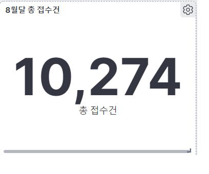
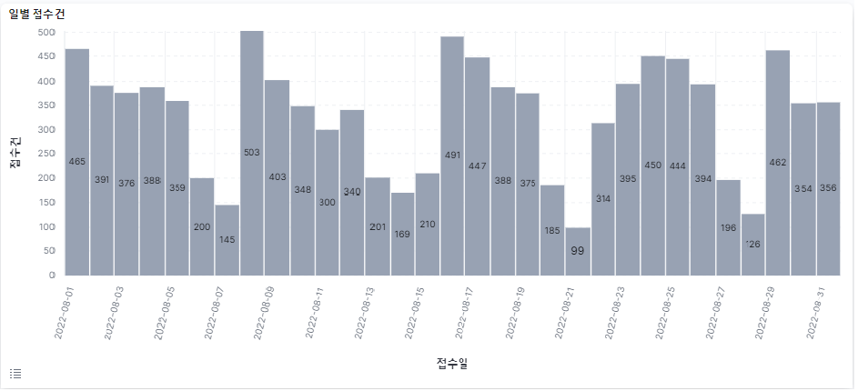
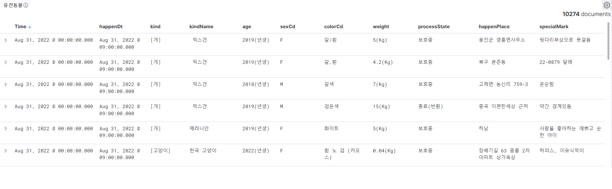
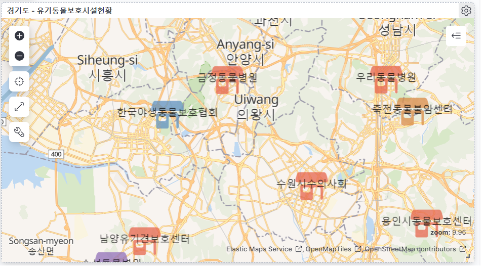

<h1 align="center"> 2022 SW Education for Vietnamese Students in Korea </h1>

<h1 align="center">  PROJECT REPORT </h1>

<h2 align="center"> 유기견보호 관리시스템 연구 </h2>

### **Author**: Navi Team  
Email: naviteam24566@gmail.com
   
| 팀원     | 이메일 | 전화번호 | 역할 |
|:---------|:----------:|:----------:|:----------:|
| 황반콰  | hoangkhoa21921541@gmail.com | 010 - 2388 - 1398 | 보고서 및 PPT 작성|
| 황티타오 | hoangthao21921541@gmail.com | 010 - 5788 -1398 | 보고서 작성 및  웹사이트 |
| 도트엉동 | truongdong.sju@gamil.com | 010 - 9751 -9606 | 프로그램 작성 및 debug |
| 반광틴 | quangthinh.276@gmail.com | 010 - 2800 -2767 |  chatbot |
| 팜티궤느  | phamthiquenhu.inu@gmail.com | 010 - 4472 -1095 | 데이터, 프로그램 처리 및 분석|
   

<h3 align="left"> I. 유기견 개념 및 현황 </h3>
<h4 align="left"> 1. 유기견 개념  </h4>

   유기동물 (영어: abandoned pets)은 주인의 실수, 혹은 의도적인 목적으로 인하여 버려진 이국적인 동물, 혹은 반려동물을 뜻한다.   
 이 동물들은 음식과 물이 없어 죽는 경우가 많지만, 운이 좋은 경우 부동산 업자와 은행 사무관의 차압과정에서 발견되기도 한다.  
 
 <h4 align="left"> 2. 유기견 현황  </h4>
 
 * 대한민국에서는 2011년 기준 매년 8만 여 마리의 반려동물이 버려지는 것으로 집계된다.
 * 버려지는 반려동물이 매년 10만 여 마리에 달한다는 의견도 있다.
 * 유기동물의 전년대비 증가율은 16년 9.3%, 17년 14.4%, 18년 17.9%를 기록하였다.
 * 유기동물이 늘어나면서 구조·보호 비용을 포함한 운영비도 많이 늘어났다. 
 * 2018년 동물보호센터 운영비는 전년의 155억 5000만원에 비해 28.9%가 증가한 200억 4000만원이 소요되었다.
 
 <h4 align="left"> 3. 유기견 이유  </h4>
 
 동물들은 다양한 이유로 인해 유기된다:
 * 예쁘고 귀엽다는 이유로 입양했다가 나중에 늙고 병들어 동물의 외모가 마음에 들지 않거나 많이 다쳐서 치료비가 부담들어서 등, 다양한 명분을 들며 반려동물을 유기한다.
 * 주인이 동물의 행동과 심리를 이해하지 못해서 생긴 갈등 때문에 유기하는 경우도 있다.
 * 유기동물들은 주로 주인의 죽음이나, 혹은 동물들이 너무 커지거나 질병에 걸린 경우 발생한다.

<left><left>

 
 <h3 align="left"> II. 데이터 처리 및 분석 </h3>
 
 <h4 align="left"> 1. 진행 방식  </h4>
 
* Open data를 가져오기.
* 데이터를 수정 및 import 하기.
* 인덱스 매핑 및 템플릿을 이용하고 인덱스 생성.
* 키바나를 통해서 시각화하기 (잠고: 엘라스틱서치, 키바나, 러그스태스를 설치하고 실행한다) Dashboard 결과 에 분석한 결과를 보러가기를 바람.
 
 <h4 align="left"> 2. 데이터 를 가져 오기  </h4>
 
 동물보호관리시스템 유기동물 조회 서비스:  
 *  공공데이터 URL [Data](https://www.data.go.kr/data/15098931/openapi.do) (농림축산식품부 농림축산검역본부_동물보호관리시스템 유기동물 조회 서비스)에 접속하고 조회를 할 수 있도록 **인증키**를 받아야 한다.
   
  *  http://apis.data.go.kr/1543061/abandonmentPublicSrvc/abandonmentPublic?bgnde=20211201&endde=20211231&pageNo=1&numOfRows=10&serviceKey=인증키(URL Encode)
   
   이 링크에 원하는 날짜, 페이지 번호, 페이지당 보여줄 개수를 수정하고 **인증키**를 넣으면 된다.
 
 <h3 align="left"> III. 유기견보호에 대한 분석하기 </h3>
 
* 다음 링크를 참여하고 기간은 2022년 8월 1일 ~ 2022년 8월 31일을 선정하기를 바란다. 다음 URL를 크릭하여 Dashboard 보여줄 것이다.  

<h4 align="left"> 3.1: 2022년 8월 1일 ~ 2022년 8월 31일:  </h4>
   
     * 총 접수건 및 일별 접수건은 얼마인가? 
     

 

 

 
     
  <em>그림 1: 총 접수건 및 일별 접수건 </em>

<h4 align="left"> 3.2: 일별 풍종별 잡수건 및 각 풍종별 잡수건 얼마인가? </h4>

 

 

 

 
     
  <em>그림 2: 일별 품종별 및 각 품종별 접수건 </em>

<h4 align="left"> 3.3: 품종별 성별 색상은 어떻게 되나요?? </h4>

 

 
     
  <em>그림 3:  품종별 성별 색상 </em>

<h4 align="left"> 3.4: 품종별 주요 품종접수는 어떻게 되나요?? </h4>

 

   

 

 
     
  <em>그림 4:  품종별 주요 품종접수 </em>

   
 <h4 align="left"> 3.5: 나이와 체중 관계가 어떻게 되나요? </h4>

 

 
     
  <em>그림 5:  나이와 체중 관계 </em>

   
<h4 align="left"> 3.6: 총 보호소 및 보호소별 품종별 보호상태 통계가 어떻게 되나요? </h4>

 

   
 

 

   
 

 

   
 
     
  <em>그림 6: 총 보호소 및 보호소별 품종별 보호상태 통계 </em>

<h4 align="left"> 3.7: 보호소별 보호상태 및 품종별은 어떻게 되나요? </h4>
   

 

   
 

 

   
 
     
  <em>그림 7: 보호소별 보호상태 및 품종별 </em>

 
 <h4 align="left"> 3.8: 유건동물은 어떻게 되나요? </h4>
   
 

    
 

   
 
     
  <em>그림 8: 유건동물 </em>

   
<h4 align="left"> 3.9: 경기도 보호소 맵 </h4>
   
 
   
 

   
 
     
  <em>그림 9: 유건동물 </em>

